# Project 1: SIMD Kernel Profiling and Analysis

**Course:** ECSE 4320/6320 – Advanced Computer Systems  
**Author:** Thanh Ho  
**Machine:** [13th Gen Intel(R) Core(TM) i7-1355U (1.70 GHz), caches, RAM, Windows 11, c]  
**Date:** [Submission date]  

---

## 1. Baseline & Correctness (10 pts)

- **Scalar baseline established** (5 pts)  
  - Kernels: SAXPY, Dot, Elementwise Multiply  
  - Validation: [method used, e.g., compare against NumPy or high-precision reference]  
  - Error tolerance: [e.g., relative error < 1e-6]  
  - Results:  


## Project 2: Performance graphs

The following graphs were generated from the Project 2 kernel benchmarks (scalar and SIMD). They are included here by relative path so they render on GitHub when viewing the repository.

### SAXPY
<p align="center">
  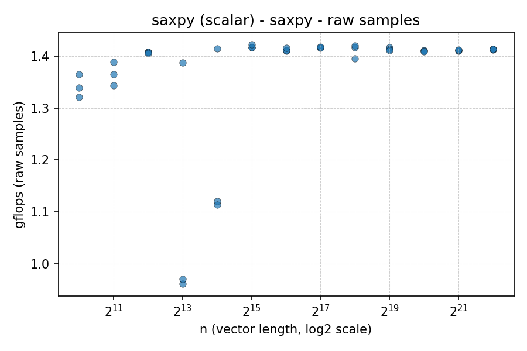
  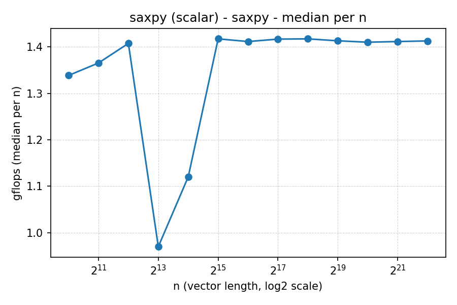
  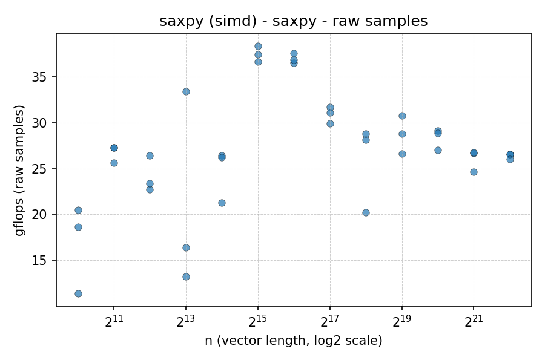
  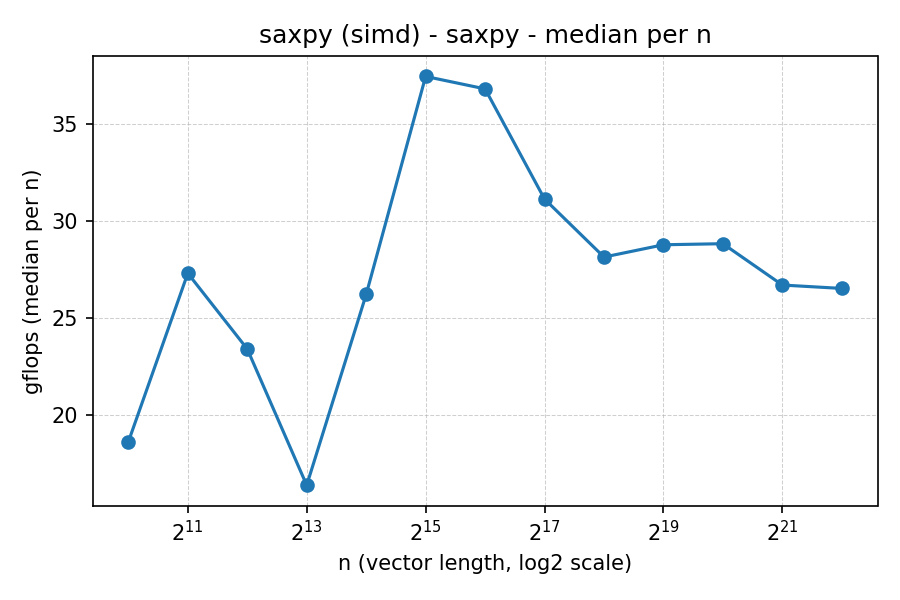
</p>

### Dot product
<p align="center">
  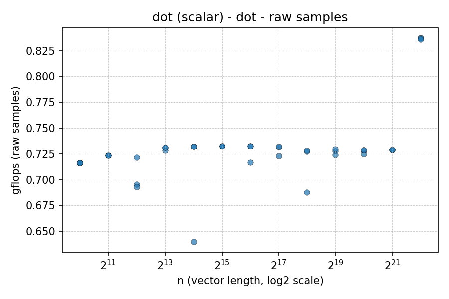
  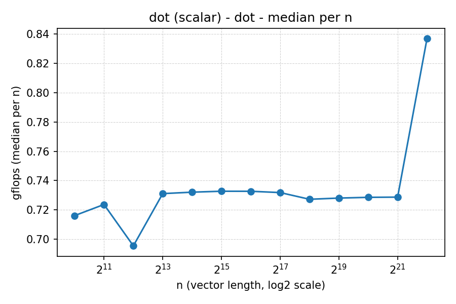
  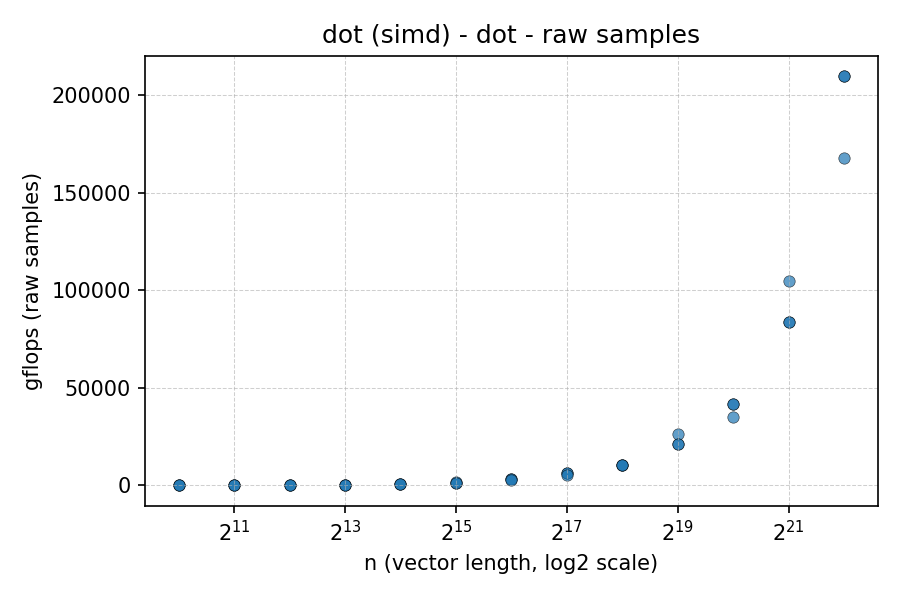
  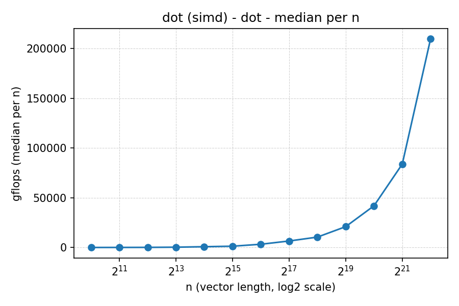
</p>

### Elementwise multiply
<p align="center">
  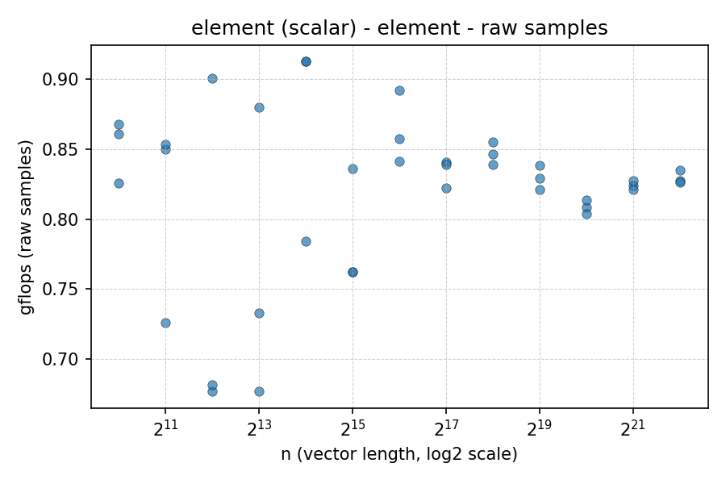
  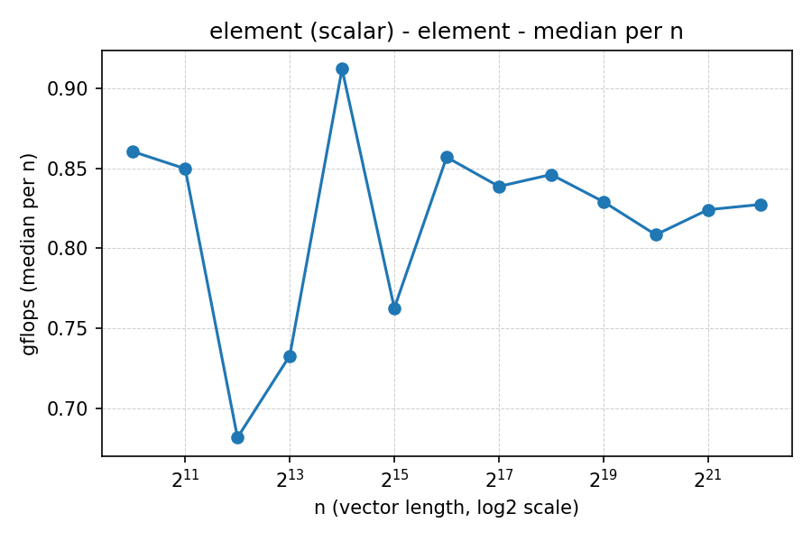
  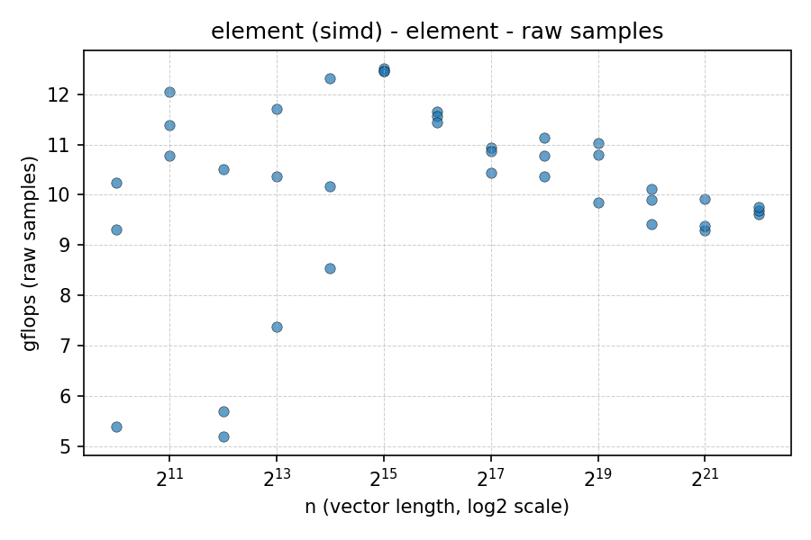
  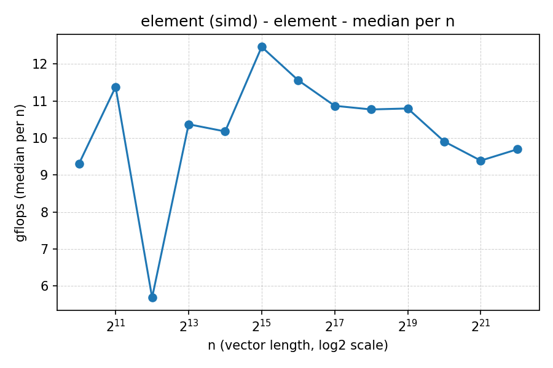
</p>

    Example:
    Scalar vs Reference: Max rel error = 3.2e-7
- **Reproducible timing methodology** (5 pts)  
  - Core binding: [e.g., taskset -c 0]  
  - CPU governor: [performance / userspace fixed freq]  
  - Repeats: [e.g., 5 per size]  
  - Example timing plot:  
  

---

## 2. Vectorization Verification (15 pts)

- **Evidence of SIMD** (10 pts)  
  - Compiler vectorization reports (`-fopt-info-vec`):  
    ```
    Example report snippet
    ```
  - Assembly snippet showing vector instructions:  
    ```
    vfmadd132ps %ymm1,%ymm2,%ymm0
    ```
- **Interpretation** (5 pts)  
  - Vector width: [e.g., AVX2 = 256-bit → 8 floats per instruction]  
  - FMA usage: [yes/no, evidence]

---

## 3. Locality Sweep (15 pts)

- **Cache transitions identified** (10 pts)  
  - Tested sizes: [list of sizes used]  
  - Observed transitions:  
    - L1 capacity ≈ … KB → drop at N ≈ …  
    - L2 capacity ≈ … KB → drop at N ≈ …  
    - LLC capacity ≈ … MB → drop at N ≈ …  
  - Annotated plot:  
  
- **Discussion** (5 pts)  
  - SIMD advantage shrinks once memory-bound beyond LLC.

---

## 4. Alignment & Tail Study (10 pts)

- **Quantified impact** (10 pts)  
  | Case         | GFLOP/s | Slowdown vs aligned |
  |--------------|---------|----------------------|
  | Aligned      | …       | –                    |
  | Misaligned   | …       | …%                   |
  | With Tail    | …       | …%                   |

Explanation: [brief discussion of why misalignment/tail hurts].

---

## 5. Stride / Gather Effects (10 pts)

- **Analysis** (10 pts)  
  - Strides tested: [1, 2, 4, etc.]  
  - Results plot:  
    
  - Conclusion: [cache line underutilization, prefetcher inefficiency, etc.]

---

## 6. Data Type Comparison (10 pts)

- **float32 vs float64 (and/or int32)** (10 pts)  
  - Lane width reasoning:  
    - AVX2: 8×float32, 4×float64  
  - Results plot:  
    
  - Discussion: [precision vs throughput tradeoff]

---

## 7. Speedup & Throughput Plots (10 pts)

- **Scalar vs SIMD plots** (10 pts)  
  - GFLOP/s:  
    
  - Speedup:  
  

---

## 8. Roofline Analysis (20 pts)

- **Arithmetic intensity & placement** (10 pts)  
  - Example (SAXPY):  
    - FLOPs/element = 2  
    - Bytes/element = 12 (read x + read y + write y)  
    - AI = 0.167 FLOPs/byte  
  - Roofline plot:  
  
- **Conclusions** (10 pts)  
  - [Kernels compute-bound in-cache, memory-bound for large N, SIMD gains capped by bandwidth]

---

## 9. Reporting Quality (10 pts)

- **Repo structure:**  
