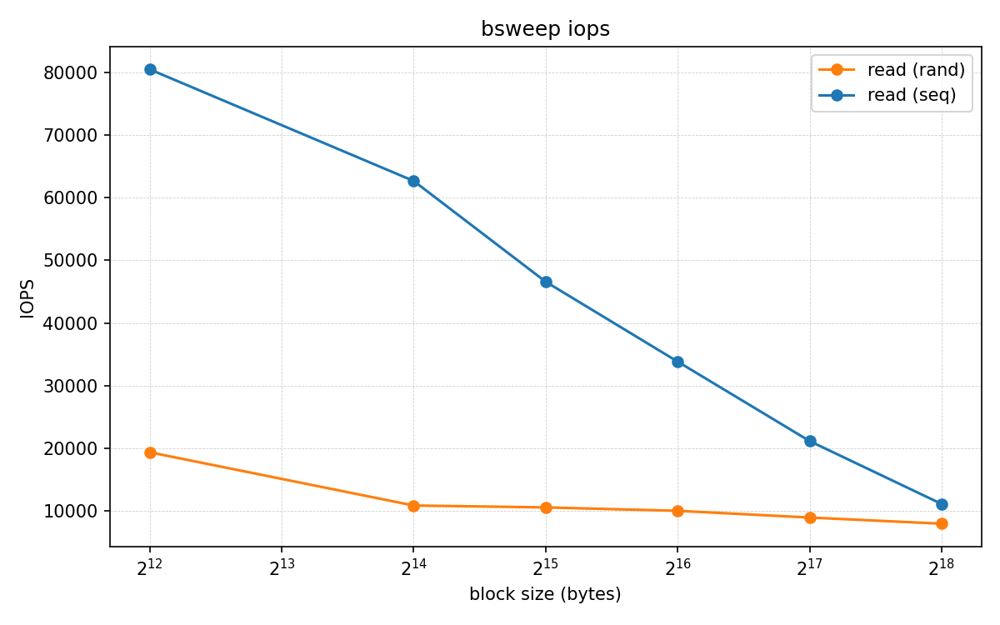
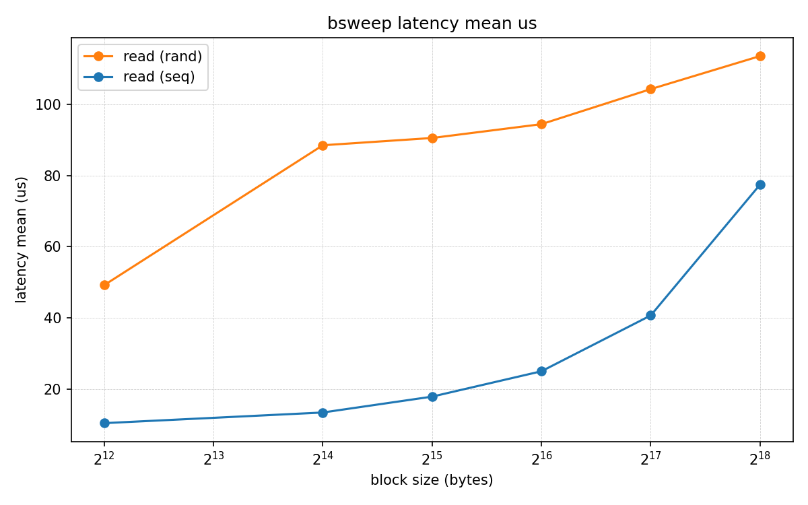
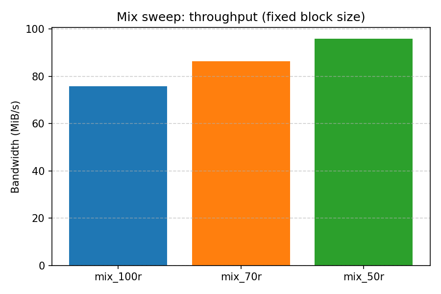
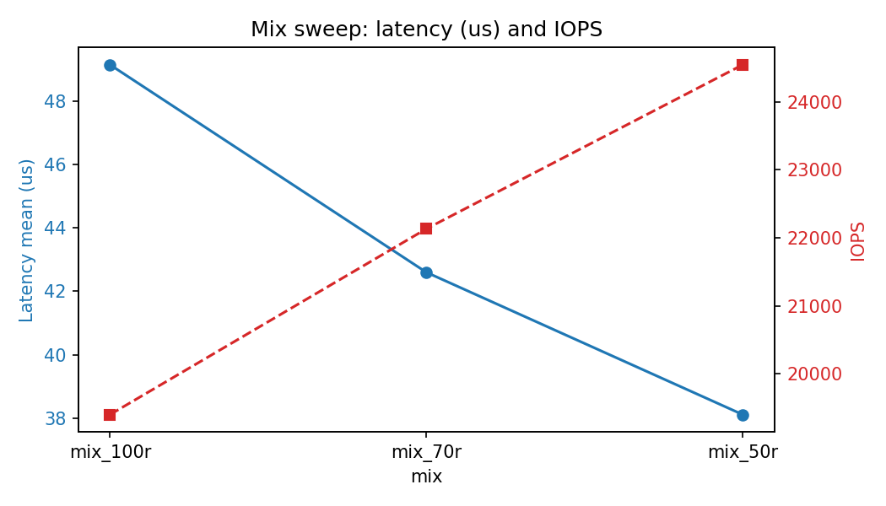
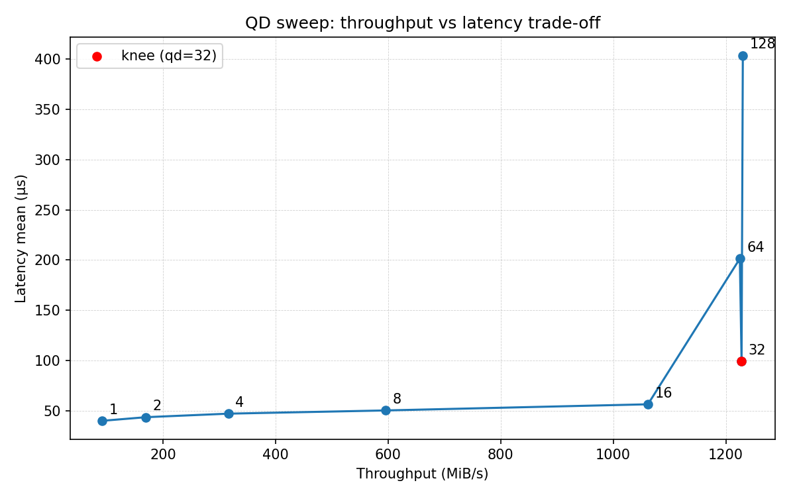
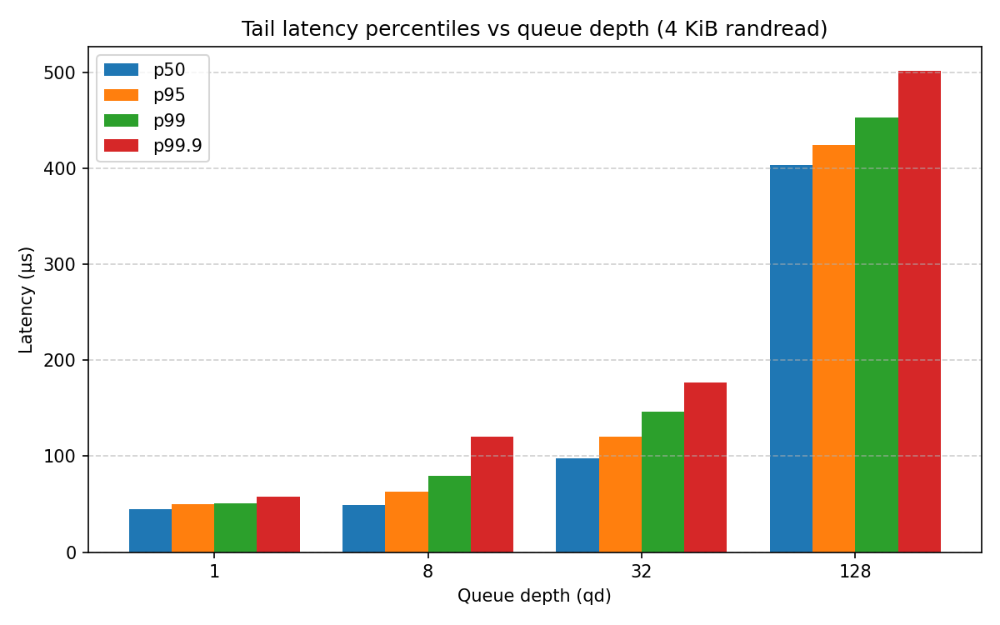

# Project 3 — SSD Performance Profiling

## System / testbed
- **CPU:** [AMD Ryzen 7 7800X3D]
- **RAM:** [size + speed]
- **SSD:** [vendor/model, interface (NVMe PCIe x4 / SATA), capacity]
- **OS:** Arch Linux x86_64 
- **Kernel:** 6.16.8-arch3-1 
- **Test device used:** `/dev/nvme0n1` (dedicated test device) with test file: `~/fio-tests/fio_testfile`
- **fio version:** 3.39
- **nvme version:** 2.15 (git 2.15)
- **libnvme version:** 1.15 (git 1.15)
- **smartctl version:** 7.5 2025-04-30 r5714 [x86_64-linux-6.16.8-arch3-1] (local build)

## Safety / methodology
- Tests performed on spare device `/dev/…` / large file on empty FS.
- `--direct=1` used to bypass page cache.
- Preconditioning details (time, iodepth, pattern).
- CPU governor fixed to `performance` and test pinned to core(s) where appropriate.
- Repeats: N = [3] runs; report mean ± std.
- Time-based runs (durations): [30 s / 60 s / 120 s] as indicated.

## Tools & scripts
- `scripts/precondition_write.sh` — precondition SSD (random writes).
- `scripts/zero_queue.sh` — QD=1 latency runs for 4KiB rand and 128KiB seq.
- `scripts/block_size_sweep.sh` — block size sweep for rand/seq.
- `scripts/rw_mix_sweep.sh` — 100%R, 100%W, 70/30, 50/50 at 4KiB.
- `scripts/qd_sweep.sh` — QD sweep (e.g., 1→128).
- `scripts/tail_latency.sh` — p50/p95/p99/p99.9 capture.
- `scripts/collect_drive_info.sh` — SMART & nvme logs.
- All fio runs write JSON to `data/fio/...`.

## Experiments
1. Zero-queue (QD=1) latencies — table (avg, p95, p99).
2. Block-size sweep — plot + analysis.
3. Read/write mixes — plot + analysis.
4. QD sweep (throughput vs latency) — plot with knee marked + Little’s Law check.
5. Tail latencies — p50/p95/p99/p99.9 + discussion.
6. Working-set / LBA-range effects — results and explanation (SLC cache, controller behavior).
7. Anomalies / limitations — e.g., thermal throttling, SLC caching, device busy background tasks.

## How to reproduce (example)
```bash
# 1) Preconditions
sudo ./scripts/precondition_write.sh /dev/nvme0n1 300

# 2) Zero-queue latencies
sudo ./scripts/zero_queue.sh /dev/nvme0n1 30

# 3) Block-size sweep
sudo ./scripts/block_size_sweep.sh /dev/nvme0n1 30

# 4) QD sweep
sudo ./scripts/qd_sweep.sh /dev/nvme0n1 30

# 5) collect SMART
sudo ./scripts/collect_drive_info.sh /dev/nvme0n1
```

## Process

For project 3, either make an empty partition to test the SSD, or make a file to test against.

### Test File
For this project, a test file will be used. Below is a shell script to make a 20GB file for testing.
```bash
mkdir -p ~/fio-tests

# allocate a 20 GB file for testing
dd if=/dev/zero of=~/fio-tests/testfile bs=1M count=20480 status=progress
```
### Tasks 1-4
After making the test file, tasks 1 through 4 can be run using the Task1_4.sh bash shell script. To use the script, input the path of the test file and the output directory as so:
```bash
./Task1_4.sh <testfile> <output_dir>
```

here are some example command lines:
```bash
./Task1_4.sh ~/fio-tests/testfile results/
```
### Zero-queue Baselines
| Workload | I/O Type         | Block Size | Avg Latency (µs) | p95 Latency (µs) | p99 Latency (µs) | IOPS   |
| -------- | ---------------- | ---------- | ---------------- | ---------------- | ---------------- | ------ |
| 1        | Random Read      | 4 KiB      | 49.2             | 50.43            | 56.06            | 19,278 |
| 2        | Random Write     | 4 KiB      | 23.2             | 23.7             | 29.06            | 38,648 |
| 3        | Random Read      | 128 KiB    | 114.11           | 115.20           | 117.25           | 8,745  |
| 4        | Random Write     | 128 KiB    | 48.85            | 48.38            | 50.9             | 18,096 |
| 5        | Sequential Read  | 4 KiB      | 12.27            | 10.56            | 17.28            | 80,338 |
| 6        | Sequential Write | 4 KiB      | 23.25            | 23.68            | 28.8             | 38,651 |
| 7        | Sequential Read  | 128 KiB    | 50.53            | 81.41            | 100.86           | 19,715 |
| 8        | Sequential Write | 128 KiB    | 48.93            | 48.90            | 50.94            | 17,825 |

### Block-size Sweep

The block-size sweep results (bsweep) are shown below. IOPS and mean latency (µs) were extracted from `fio-results.csv` and plotted.

<p align="center">
	
</p>

<p align="center">
	
</p>

### Read/Write Mix Sweep

The read/write mix sweep (4 KiB fixed block size, varying read/write mix) results are shown below. Throughput (MiB/s) and latency (mean µs) were collected for the mixtures 100%R, 70/30R/W, and 50/50.

<p align="center">
	
</p>

<p align="center">
	
</p>


### Queue-depth/parallelism sweep

The queue-depth sweep measures throughput vs latency as concurrency (queue depth / numjobs) increases. The trade-off curve below was generated from `fio-results.csv` and the knee point was detected automatically (see Little's Law summary).

<p align="center">
	
</p>


Interpretation notes:
- The knee in the trade-off curve indicates the concurrency level where throughput gain begins to diminish while latency increases rapidly.

### Tail-latency characterization

Tail latency percentiles were extracted for 4 KiB random read at several queue depths (qd = 1, 8, 32, 128). The grouped bar chart below shows p50, p95, p99 and p99.9 for each qd. A CSV summary is available at `plots/tail_latency_summary.csv`.

<p align="center">
	
</p>

